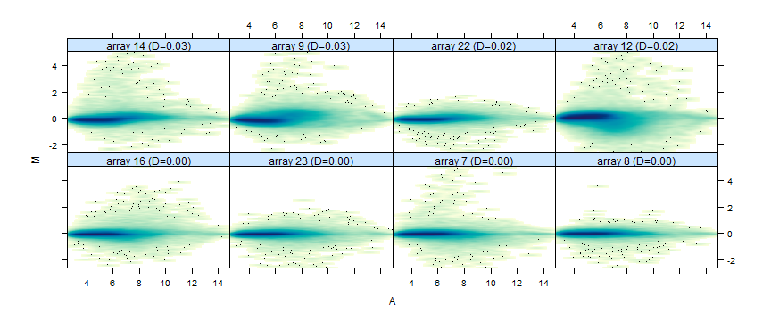
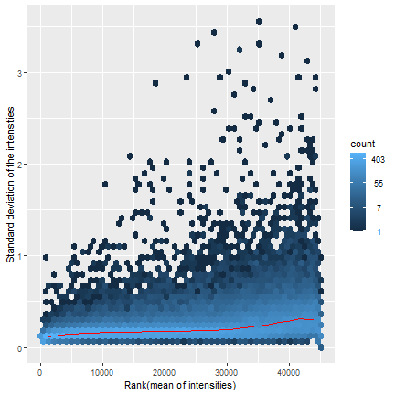
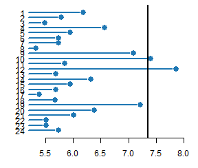

```{r setup, include=FALSE}
knitr::opts_chunk$set(echo = TRUE)
```

#   1. Introducción y objetivos

Utilizando un modelo de ratón, investigamos la utilidad de los antibióticos LINEZOLID y VANCOMICINA para la Inmunomodulación durante infecciones por Staphylococcus aureus resistente a Meticilina. La información sobre las muestras, así como sus condiciones experimentales se contiene en el fichero `allTargets.txt`.

```{r}
allTargets<-read.table("allTargets.txt", header = TRUE)
allTargets
```

Como se puede observar, el dataset contiene los datos de 35 muestras, 15 tomadas antes de la infección, 20 después, 5 que eliminaremos a las 2 horas de la misma y 15 a las 24 horas. Nuestro objetivo, entonces, será intentar caracterizar, a través del cambio en la expresión génica, el efecto de la infección y del tratamiento con antibióticos, así como comparar los efectos de estos.

Para ello, realizaremos las comparaciones siguientes:

*   Infectados VS no infectados sin tratamiento
*   Infectados VS no infectados tratados con LINEZOLID
*   Infectados VS no infectados tratados con VANCOMICINA

Primero, para cargar todos los datos de las muestras desde Gene Expression Omnibus (GEO), tendremos que cargar el paquete BioConductor, así como GEOquery.

```{r message=FALSE, warning=FALSE}
if (!requireNamespace("BiocManager", quietly = TRUE)) {
  install.packages("BiocManager")
}

library(GEOquery)
```

Ahora que tenemos los paquetes cargados en nuestro entorno, podemos importar los datos del experimento, identificados con **GSE38531**

```{r}
getGEOSuppFiles("GSE38531", makeDirectory = TRUE)
```

Si verificamos nuestro directorio de trabajo, ahora tendremos una nueva carpeta llamada `GSE38531_RAW.tar` con los datos crudos, almacenados y comprimidos en formato TAR. Para descomprimirlo, podemos usar la función `untar()`. Debemos recordar que, como hemos creado un directorio en el que descargar el fichero, tendremos que especificar dicho directorio en la función (*GSE38531*), ya que no se encuentra en el directorio actual de trabajo. 

```{r}
untar("GSE38531/GSE38531_RAW.tar", exdir = "GSE38531_RAW")
```

Ahora, dispondremos de todos los archivos comprimidos, uno por muestra, identificados con el mismo nombre de la muestra (la columna sample de allTarget), ubicados en una nueva carpeta llamada GSE38531_RAW. 

Con tal de simplificar el análisis, y dificultar un mínimo el intercambio no permitido de información, eliminaremos las muestras tomadas a las 2 horas (5 muestras), y elegiremos al azar 4 muestras de cada grupo, obteniendo un total de tamaño muestral de 12 (3 grupos, 4 muestras).

Para ello, tendremos que generar una nueva función, `filter_microarray` que realizará ambas acciones (filtro y muestreo). 

La función primero establecerá una semilla, de manera que aseguremos la reproducibilidad. Seguidamente, usaremos subset para que las filas en que time sea diferente a 2 no pasen el filtro, y se almacenaran en `filtered`. 

En filtered, se creará una nueva columna llamada *group* en que se muestra la interacción entre las columnas infection (infección o no) y agent (tratamiento). De esta manera, obtendremos los 6 posibles grupos experimentales resultados de su combinación.

Ahora que tenemos especificados los grupos, seleccionaremos 4 muestras aleatorias de cada grupo, reduciendo el tamaño muestral de 30 a 24 (eliminamos una muestra de cada grupo). Para poder hacerlo, split dividirá el data frame (filtered) en los diferentes grupos, y en caso de que el grupo sea superior a 4, seleccionará aleatoriamente 4 muestras (con la función `sample()`). 

Finalmente, obtendremos los índices originales de las muestras seleccionadas en el conjunto original, para después concatenar los índices con los nombres de las muestras y se asignan como el nombre de las filas en selected. Por último, se elimina la columna group creada anteriormente (ya no hace falta) y devolverá las muestras seleccionadas.

```{r}
filter_microarray <- function(allTargets, seed = 39432449) {
  # Configurar la semilla aleatoria
  set.seed(seed)
  
  # Filtrar las filas donde 'time' no sea 'hour 2'
  filtered <- subset(allTargets, time != "hour 2")
  
  # Dividir el dataset por grupos únicos de 'infection' + 'agent'
  filtered$group <- interaction(filtered$infection, filtered$agent)
  
  # Seleccionar 4 muestras al azar de cada grupo
  selected <- do.call(rbind, lapply(split(filtered, filtered$group), function(group_data) {
    if (nrow(group_data) > 4) {
      group_data[sample(1:nrow(group_data), 4), ]
    } else {
      group_data
    }
  }))
  
  # Obtener los índices originales como nombres de las filas seleccionadas
  original_indices <- match(selected$sample, allTargets$sample)
  
  # Modificar los rownames usando 'sample' y los índices originales
  rownames(selected) <- paste0(selected$sample, ".", original_indices)
  
  # Eliminar la columna 'group' y devolver el resultado
  selected$group <- NULL
  return(selected)
}
```

Ahora que tenemos la función `filter_microarray` creada podemos aplicarla a nuestro grupo allTargets y obtendremos un nuevo data frame con 4 muestras por grupo (24 muestras) con las filas nombradas en función del índice original. Como las variables infection, time y agent son categóricas, asignaremos dichas variables como factor.

```{r}
Targets<-filter_microarray(allTargets, seed = 39432449)
Targets$infection<-as.factor(Targets$infection)
Targets$time<-as.factor(Targets$time)
Targets$agent<-as.factor(Targets$agent)
summary(Targets)
```

Ahora que tenemos las muestras en las que trabajaremos, tendremos que obtener los archivos .CEL de las muestras para poder generar el ExpressionSet. Estos archivos contienen información sobre los experimentos de microarrays en affymetrix, y contienen los datos crudos (rawData) obtenidos directamente de la maquinaria. 

Para acceder a los archivos .CEL, primero tendremos que descomprimir los archivos .gz de GSE38531_RAW. Usaremos lapply para ejecutar la descompresión en todos los archivos en formato gz del directorio GSE38531_RAW.

```{r message=FALSE, warning=FALSE}
gz_files <- list.files(path = "GSE38531_RAW", pattern = "\\.gz$", full.names = TRUE)
invisible(lapply(gz_files, function(x) gunzip(x, remove = FALSE)))
```

Ahora que tenemos los archivos descomprimidos, almacenaremos todos los ficheros CEL en una lista de objetos (CEL_files). Estos ficheros tienen un nombre con el identificador de la muestra, pero tienen una extensión considerable y no homogénea, por lo que crearemos una nueva lista con los nombres de los archivos en que tengan como nombre únicamente el nombre de la muestra.

```{r message=FALSE, warning=FALSE}

CEL_files <- list.files(path = "GSE38531_RAW", pattern = "\\.CEL$", full.names = TRUE)
newNames <- paste0(substr(basename(CEL_files), 1, 9), ".CEL")

# Aplicar el cambio de nombre
file.rename(CEL_files, file.path(dirname(CEL_files), newNames))
```

Ahora que tenemos los nombres modificados, obtendremos de nuevo la lista CEL_files (la misma lista), en que la nueva lista contendrá los archivos con nombres modificados. 

```{r message=FALSE, warning=FALSE}
CEL_files <- list.files(path = "GSE38531_RAW", pattern = "\\.CEL$", full.names = TRUE)
head(CEL_files)
```

Finalmente, obtendremos una nueva lista con únicamente los nombres de las muestras, de manera que, aquellos archivos que no se encuentren en nuestras muestras, se eliminarán del directorio, quedándonos sólo con aquellos archivos CEL que pertenecen a la muestra seleccionada (24 archivos CEL, uno por cada muestra). 

```{r message=FALSE, warning=FALSE}
#Eliminamos los archivos que no queremos
celFileNames <- substr(basename(CEL_files), 1, nchar(basename(CEL_files)) - 4)
filesToDelete <- CEL_files[!(celFileNames %in% Targets$sample)]
file.remove(filesToDelete)
```

Las respuestas `TRUE` que nos devuelve file.remove nos indica que los archivos se han eliminado (recibimos uno por cada archivo).

#   2. Métodos

##    2.1 Creación del Expression Set.

Ahora que sabemos que archivos formaran parte del ExpressionSet, los meteremos en un objeto llamado rawData. Primero especificaremos el directorio de trabajo (setwd), y lo almacenaremos en workingDir. Además, crearemos dos objetos con las rutas de acceso para los resultados (donde almacenaremos toda la información resultante) y los datos de origen (GSE38531_RAW).

```{r}
setwd()
workingDir<-getwd()
dataDir<-file.path(workingDir,"GSE38531_RAW")
resultsDir<-file.path(workingDir,"results") 
```

Para la creación del ExpressionSet necesitaremos cargar el paquete Affy, que nos permitirá cargar los archivos CEL en un rawData, y el paquete Biobase, que nos permitirá la creación del ExpressionSet.

```{r}
library(affy)
library(Biobase)
```

Respecto a los nombres de las muestras, asignaremos la variable sample del dataframe Targets para etiquetar las muestras. También crearemos un AnnotatedDataFrame para las muestras, en que necesitaremos Targets (las muestras filtradas) que contiene información sobre la muestra y el grupo experimental al que pertenecen. Esto será necesario, ya que permitirá almacenar los metadatos que introduciremos en el ExpressionSet.

```{r}
row.names(Targets) <- Targets$sample
Targets_Annotated <- AnnotatedDataFrame(Targets)
str(Targets_Annotated)
```

Como hemos mencionado anteriomente, los archivos CEL del directorio son aquellos que han sido seleccionados con la función filter_microarray, y por lo tanto, cargaremos dicha información con la función ReadAffy, usando el AnnotatedDataFrame para especificar los metadatos del objeto AffyBatch.

```{r}
CEL_files <- list.files(path = dataDir, pattern = "\\.CEL$", full.names = TRUE)

#Creamos el rawData
rawData <- ReadAffy(filenames = CEL_files, phenoData = Targets_Annotated)
```


Ahora tenemos un objeto en formato AffyBatch, el cual tendremos que convertir en ExpressionSet. Para ello, primero extraeremos la infromación necesaria: los datos de expresión (exprs), la información de las muestras (pData) y la información de los genes (fData).

```{r}
exprs_data <- exprs(rawData)  # Datos de expresión
pheno_data <- pData(rawData)  # Información de las muestras (phenoData)
feature_data <- fData(rawData)  # Información de los genes (fData)
```

Ahora que tenemos los datos necesarios, podremos emplear el AffyBatch para crear el Expression_set

```{r}
# Crear el ExpressionSet
expression_set <- ExpressionSet(assayData = exprs_data,
                                phenoData = AnnotatedDataFrame(pheno_data),
                                featureData = AnnotatedDataFrame(feature_data))

str(expression_set)
```

##    2.2 Análisis exploratorio y control de calidad.

Con el expression_set, ahora podemos realizar un análisis superficial de los datos, para observar su distribución. Para ello, extraeremos los datos de expresión con la función exprs(), y crearemos un boxplot para ver como se distribuyen los datos de las muestras.

```{r}
# Extraemos los datos de expresión del ExpressionSet
expression_data <- exprs(expression_set)

# Crearemos el boxplot de los datos de expresión
boxplot(expression_data, 
        main = "Boxplot de ExpressionSet", 
        xaxt = "n",  # Desactivar etiquetas del eje X
        col = "lightblue")

# Ajustar las etiquetas del eje X para que se muestren los nombres de las muestras
axis(1, at = 1:ncol(expression_data), labels = colnames(expression_data), cex.axis = 0.5)
```

Este boxplot representará las intensidades de señal para cada muestra del ExpressionSet, y observamos que las cajas tienen una altura y posición similares entre todas las muestras, lo que indica que las intensidades crudas (sin normalizar) no tienen grandes diferencias globales entre ellas. Esto podría indicar que no hay errores evidentes en la generación de los datos.

Vemos que hay círculos fuera de rango que representan los outliers, pero es habitual en datos de microarrays crudos sin normalizar. Aunque la distribución parece consistente, necesitamos realizar una normalización (como RMA) para ajustar las diferencias sistemáticas entre muestras para mejorar la compatibilidad.

Por lo tanto, tendremos que realizar una normalización RMA, que convertirá el rawData con datos crudos en un ExpressionSet con los datos normalizados. La normalización RMA (Robust Multi-Array Average) realizará un proceso de corrección de background, una normalización y un summarization.

```{r}
normalized_data <- rma(rawData)
str(normalized_data)
```
Ahora que tenemos los datos normalizados, recraremos el boxplot con los datos normalizados.

```{r}
# Boxplot post normalización
boxplot(exprs(normalized_data), main = "Dades normalitzades amb RMA", col = "lightgreen", xaxt = "n")
axis(1, at = 1:ncol(exprs(normalized_data)), labels = colnames(exprs(normalized_data)), cex.axis = 0.5)
```

Vemos que el boxplot muestra una distribución homogénea entre las muestras, lo que indica que la normalización ha sido exitosa. Ahora, con las cajas alieneadas, podemos afirmar que las intensidades están en una escala comparable. 

Para evaluar la calidad de los datos del ExpressionSet, cargaremos el paquete arrayQualityMetrics y ejecutaremos el control de calidad en los datos normalizados y sin normalizar, de manera que compararemos los datos para ver si la normalización mejoroó la calidad de los datos crudos.

Como hemos especificado un directorio para los resultados, dirigiremos el flujo de salida en ese directorio, creando la carpeta control_calidad para guardar los gráficos de calidad.

```{r warning=FALSE}
library(arrayQualityMetrics)

# Control de calidad
arrayQualityMetrics(expressionset = normalized_data, 
                    outdir = file.path(resultsDir, "control_calidad"), 
                    force = TRUE)

if(FALSE){
  arrayQualityMetrics(rawData,reporttitle="QC_RawData",force=TRUE)
}

```
Gracuas al control de calidad, podemos obtener diferentes gráficos (MA plot, Mean vs Standar Deviation, boxplot, msd, etc.).



En el gráfico MA PLOT se nos muestra las relaciones entre intensidades promedio (A) y diferencias relativas (M). En el eje A se representa la intensidad promedio de las sondas, mientras que el eje M representa la diferencia relativa. Por lo tanto, idealmente los puntos (las sondas) deben estar distribuidos simétricamente alrededor de la línea M=0, pero vemos que hay ciertos puntos que se mueven de ese eje. Aún así, vemos que la mayor nube se centran en el eje, y no podemos apreciar patrones o estructuras anómalas. 



En el gráfico de Mean vs Standar Deviation, se evalúa la relación entre la intensaidad promedio y su desviación estándar. Vemos que la mayoría de los puntos se arremolinan en la base, con ciertos puntos que se alejan, pero no es excesivo. La curva roja representa una tendencia general para los datos, mostrando como cambia la desviación estándar según la intensidad promedio (en nuestro caso se aprecia una inclinación, pero no es excesiva, por lo que podemos afirmar que no tenemos una mala calidad en los datos normalizados). 



En el heatmap de correlación (out hm), vemos que hay dos muestras que se alejan de la línea principal de agrupamiento (ubicada cerca del 7.4), lo que sugiere que hay dos muestras que tienen patrones de expresión diferentes al resto. Esto podría deberse a problemas técnicos o diferencias biológicas marcadas, como una baja claidad de las muestras, errores en el procesamiento o fallo en la normalización de esos datos en particular.

Un análisis de control de calidad bastante importante es el Análisis de Componentes Principales (PCA), que reducirá la dimensionalidad de los datos para identificar patrones en las muestras basándose en su variabilidad. Por lo tanto, necesitaremos el paquete ggplot2.

Para realizar el PCA, necesitaremos extraer la matriz de expresión de los datos normalizados (exprs(normalized_data)) y transpondremos la matriz de datos (PCA trabaja con las muestras en las filas y las variables en las columnas y lo tenemos al revés). El resultado del PCA se almacenará en un data frame, en que obtendremos las coordenadas de las muestras en los dos principales componentes.

```{r}
library(ggplot2)
pca <- prcomp(t(exprs(normalized_data)), scale. = TRUE)
pca_df <- data.frame(PC1 = pca$x[,1], PC2 = pca$x[,2], Group = pData(normalized_data)$agent)
```

Para ver el valor de proporción de variabilidad explicada para cada PC usaremos summary sobre el resultado de prcomp().

```{r}
explained_variance <- summary(pca)$importance[2, ]  # Variancia explicada (proporción)
explained_variance
```

Vemos que entre las dos componentes principales solo explicamos aproximadamente el 40% de variabilidad total, lo cual es un valor bastante bajo, ya que necesitariamos hasta la componente principal 13 para obtener un 80% de variabilidad explicada.


Para poder visualizar el resultado, crearemos un ggplot con los dos primeros componentes principales en base al dataframe. Para ver la variabilidad explicada por cada componente principal, usaremos summary sobre el resultado del pca.

```{r}
ggplot(pca_df, aes(x = PC1, y = PC2, color = Group)) +
  geom_point(size = 3) +
  labs(title = "Anàlisi de components principals (PCA)", x = "PC1", y = "PC2") +
  theme_minimal()
```

Vemos que no se aprecia un agrupamiento en función del tratamiento (agent), pero si que se podría apreciar una diferencia entre dos grupos no relacionados. Esto podria indicar un efecto BATCH sobre los datos, es decir, un bloque aleatorio que cause esta separación.

Antes de analizar el efecto Batch, crearemos 3 PCA plot para ver si el agrupamiento corresponde a una de las variables estudiadas.

```{r}
pca_df1 <- data.frame(PC1 = pca$x[,1], PC2 = pca$x[,2], Group = pData(normalized_data)$agent)
pca_df2 <- data.frame(PC1 = pca$x[,1], PC2 = pca$x[,2], Group = pData(normalized_data)$time)
pca_df3 <- data.frame(PC1 = pca$x[,1], PC2 = pca$x[,2], Group = pData(normalized_data)$infection)

plot1<-ggplot(pca_df1, aes(x = PC1, y = PC2, color = Group)) +
  geom_point(size = 3) +
  labs(title = "Anàlisi de components principals (PCA)", x = "PC1", y = "PC2") +
  theme_minimal()
plot2<-ggplot(pca_df2, aes(x = PC1, y = PC2, color = Group)) +
  geom_point(size = 3) +
  labs(title = "Anàlisi de components principals (PCA)", x = "PC1", y = "PC2") +
  theme_minimal()
plot3<-ggplot(pca_df3, aes(x = PC1, y = PC2, color = Group)) +
  geom_point(size = 3) +
  labs(title = "Anàlisi de components principals (PCA)", x = "PC1", y = "PC2") +
  theme_minimal()

show(plot1)
show(plot2)
show(plot3)
```

Visualizaremos los tres gráficos en la misma imagen

```{r}
library(gridExtra)
grid.arrange(plot1, plot2, plot3, ncol = 1)
```
No podemos apreciar un agrupamiento debido a una de las variables, por lo que podríamos afirmar que hay una fuente de variabilidad no estudiada que agrupa las muestras en dos bloques. Es posible que haya interacciones entre las variables que no se hayan considerado en el modelo, o que el análisis de PCA (lineal) no pueda capturar ciertos efectos no lineales o relaciones complejas entre los datos.

Para seguir estudiando esta diferencia, realizaremos un análisis de la variabilidad de las muestras en función de los posibles factores de batch (las variables agent y infection). Para ello, necesitaremos cargar el paquete pvca, y la función pvcaBatchAssess. Primero cargaremos los datos de pData, así como el umbral de porcentajes de variabilidad y los factores a analizar.

```{r}
library(pvca)
pData(normalized_data) <- Targets
#select the threshold
pct_threshold <- 0.5
#select the factors to analyze
batch.factors <- c("agent", "infection","time")
#run the analysis
pvcaObj <- pvcaBatchAssess (normalized_data, batch.factors, pct_threshold)
```

Visualizaremos los resultados del PVCA en un barplot, que definirá la variabilidad explicada por cada variable e interacción posible. 

```{r}
bp <- barplot(pvcaObj$dat, xlab = "Effects",
  ylab = "Weighted average proportion variance",
  ylim= c(0,1.1),col = c("mediumorchid"), las=2,
  main="PVCA estimation")
axis(1, at = bp, labels = pvcaObj$label, cex.axis = 0.75, las=2)
values = pvcaObj$dat
new_values = round(values , 3)
text(bp,pvcaObj$dat,labels = new_values, pos=3, cex = 0.7)
```

Vemos, lamentablemente, que las variables no capturan casi nada de la variabilidad de los datos. 

##    2.3 Filtro de los datos

Aunque sabemos que el filtro de datos es un proceso sometido a debate, eliminaremos las sondas menos variables y nos quedaremos con el 10% de sondas que presenten mayor variabilidad. 

Para ello, necesitaremos cargar el paquete genefilter, y ejecutaremos la función nsFilter en que especificaremos el umbral de corte (var.cutoff=0.9) y eliminaremos los datos que inicien con AFFX (ya que pertenece a entradas de información adicional sobre la obtención de los datos). Además, solo se seleccionarán aquellos datos que tengan una antoación de Entrez Gene ID posible, y en caso contrario serán excluidos del análisis. Finalmente, el filtraje tendrá en cuenta los valores de cuantiles, ya que eliminará genes que tengan una distribución de expresión muy sesgada o valores extremos que puedan no ser útiles para el análisis.

```{r message=FALSE}
library(genefilter)
filtered <- nsFilter(normalized_data, 
                     require.entrez = TRUE, 
                     remove.dupEntrez = TRUE,
                     var.filter = TRUE, 
                     var.func = IQR, 
                     var.cutoff = 0.9, 
                     filterByQuantile = TRUE, 
                     feature.exclude = "^AFFX")
```
Ahora, tenemos un nuevo ExpressionSet con solo el 10% de los datos normalizados. Debemos recordar que el proceso de RMA ya redujo considerablemente la cantidad de datos, ya que eliminó el ruido. 

El resultado de nsFiltered nos da una lista con 2 grupos, los datos filtrados (filtered) y el expression set resultante. Para obtener el nuevo ExpressionSet con los datos filtrados usaremos $eset y los almacenaremos en filtered_data.

```{r}
filtered_data <- filtered$eset
filtered_data
```


##   2.4 Construcción de la matriz de diseño y de contraste

Para crear la matriz de diseño, necesitaremos cargar el paquete limma, pero también tendremos que modificar la pData para crear una nueva variable Group resultante de los grupos experimentales. 

Es decir, tendremos que unir el nombre de infection y agent en una nueva variable que conformará el nuevo grupo, separado por el carácter "_". Como el nombre de una de las variables tiene un punto (que podría resultar conflictivo) y tienen espacios entre palabras, modificaremos los nombres de Group.

```{r}
library(limma)
# Definir els grups
pData(filtered_data)$Group <- paste(pData(filtered_data)$infection, 
                                      pData(filtered_data)$agent, 
                                      sep = "_")
# Reemplazar los puntos por vacío (eliminarlos) y los espacios por guiones bajos (_)
pData(filtered_data)$Group <- gsub("\\.", "", pData(filtered_data)$Group)  # Eliminar los puntos
pData(filtered_data)$Group <- gsub(" ", "_", pData(filtered_data)$Group)    # Reemplazar los espacios por _
```

Ahora que la nueva variable tiene el formato deseado, crearemos el objeto groups con la información de Group, y diseñaremos un modelo que tenga encuenta groups (añadiremos 0 para eliminar el Intercept). Además, especificaremos que el nombre de las columnas sean los niveles de group (los diferentes grupos experimentales). 

```{r}
groups <- pData(filtered_data)$Group  # Assegura't que aquesta columna existeixi
design <- model.matrix(~0 + factor(groups))
colnames(design) <- levels(factor(groups))
```

Ahora, podremos visualizar la matriz de diseño, y para asegurarnos de que tenemos la matriz correctamente, evaluaremos con table que tenemos 4 muestras por grupo experimental.

```{r}
table(pData(filtered_data)$Group)
print(design)
```

Ahora que tenemos la matriz diseño, podremos crear la matriz de contrastes a partir de los grupos experimentales. Para ello usaremos makeContrasts y especificaremos los 3 contrastes explicados anteriormente, uninfected vs S. aureus para cada condición de infection, y los niveles serán especificados por la matriz diseño.

Es muy importante que los nombres de los contrastes coincidan con los niveles, pero hemos podido verificar los nombres anteriormente con table().

```{r}
contrast_matrix <- makeContrasts(
  Grup1_vs_Grup2 = uninfected_untreated - S_aureus_USA300_untreated,
  Grup1_vs_Grup3 = uninfected_linezolid - S_aureus_USA300_linezolid,
  Grup2_vs_Grup3 = uninfected_vancomycin - S_aureus_USA300_vancomycin,
  levels = design
)
```

Por último, podremos visualizar la matriz de contrastes

```{r}
print(contrast_matrix)
```


##   2.5 Obtención de los genes diferencialmente expresados

Para poder obtener los genes que se han expresado diferencialmente, tendremos que aplicar el modelo lineal (lmFit) sobre los datos de filtered_Data en base a la matriz diseño, y realizaremos el contraste en base a la matriz de contraste y realizaremos una estimación bayesiana.

```{r}
fit <- lmFit(exprs(filtered_data), design)  # Ajuste del modelo lineal
fit2 <- contrasts.fit(fit, contrast_matrix)  # Aplicar contrastes
fit2 <- eBayes(fit2)  # Estimación Bayesiana
```

Ahora, tenemos almacenados en fit2 los resultados de los contrastes, y para poder observar el resultado de dichos contrastes tendremos que emplear la función topTable(), que nos permitirá determinar el método de ajuste de p-valor, así como el umbral del p-valor. La función toptable nos permitirá ordenar en orden decreciente los valores del p-valor, dando primeros los valores más bajos (más significativos).
 
```{r}
Grup1_vs_Grup2 <- topTable(fit2, number=nrow(fit2), coef="Grup1_vs_Grup2", adjust="fdr")
Grup1_vs_Grup3 <- topTable(fit2, number=nrow(fit2), coef="Grup1_vs_Grup3", adjust="fdr")
Grup2_vs_Grup3 <- topTable(fit2, number=nrow(fit2), coef="Grup2_vs_Grup3", adjust="fdr")

head(Grup1_vs_Grup2)
head(Grup1_vs_Grup3)
head(Grup2_vs_Grup3)
```
Lamentablemente, en ninguno de los contrastes hemos obtenido un p-valor ajustado significativo. Esto puede ser debido al efecto batch y a la variabilidad no explicada vista anteriormente. 

Para poder continuar, emplearemos los p-valores sin ajustar, pero debemos tener en cuenta que estos no estan corregidos por el error de tipo I debido a las pruebas múltiples.

```{r}
g1_vs_g2<-Grup1_vs_Grup2[Grup1_vs_Grup2$P.Value < 0.05, ]
g1_vs_g3<-Grup1_vs_Grup3[Grup1_vs_Grup3$P.Value < 0.05, ]
g2_vs_g3<-Grup2_vs_Grup3[Grup2_vs_Grup3$P.Value < 0.05, ]

head(g1_vs_g2)
head(g1_vs_g3)
head(g2_vs_g3)
```

##   2.6 Anotación de los genes

En nuestro caso, el EXpressionSet está identificado basados en Affymetrix Mouse Genome 430 2.0 Array, como vemos en Annotation=mouse4302. En las topTable, las filas se nombran con el identificador, por lo que rownames() nos permitirá los identificadores de Affymetrix. Además, en el proyecto de GEO teníamos un archivo de anotaciones, GPL1261.annot, que nos permitirá ver diferentes clases de anotaciones, entre las que se encuentran Symbol y Entrez, además de información sobre la actividad biológica de los genes.

Primero, necesitaremos cargar el paquete de anotaciones que contenga las claves para nuestros genes. Como conocemos el modelo de los datos, podemos afirmar que necesitaremos el paquete de anotaciones mouse4302.db y usaremos la función mapIds para mapear las sondas. Debemos tener en cuenta que nuestras keys están en formato PROBEID, por lo que modificaremos los identificadores a ENTREZ ID, y usaremos rownames para obtener los identificadores de las sondas de cada contraste.

```{r}
library(mouse4302.db)

#Mapeado del primer contraste
mapped_ids12 <- mapIds(
  mouse4302.db,
  keys = rownames(g1_vs_g2),
  column = "ENTREZID", 
  keytype = "PROBEID",
  multiVals = "first"    # Ajusta para evitar listas
)

#Mapeado del segundo contraste
mapped_ids13 <- mapIds(
  mouse4302.db,
  keys = rownames(g1_vs_g3),
  column = "ENTREZID", 
  keytype = "PROBEID",
  multiVals = "first"    # Ajusta para evitar listas
)

#Mapeado del tercer contraste
mapped_ids23 <- mapIds(
  mouse4302.db,
  keys = rownames(g2_vs_g3),
  column = "ENTREZID", 
  keytype = "PROBEID",
  multiVals = "first"    # Ajusta para evitar listas
)
```
Una vez que hemos mapeado los identificadores ENTREZ ID, el siguiente paso será añadir estos identificadores a los resultados obtenidos en el contraste.

```{r}
g1_vs_g2$ENTREZID <- mapped_ids12
g1_vs_g3$ENTREZID <- mapped_ids13
g2_vs_g3$ENTREZID <- mapped_ids23
```

Ahora, en la lista de genes significativos, tendremos una nueva columna ENTREZID en que aparecerá el identificador en formato ENTREZ.

##   2.7 Análisis de la significación biológica

Ahora, cada lista tiene unos genes diferencialmente expresados en cada contraste. El análisis de la significación biológica identificará genes relevantes que podrían tener un impacto biológico significativo o que podrían estar involucrados en procesos biológicos clave. 

Para ello, realizaremos un análisis de enriquecimiento de Gene Ontology, por lo que necesitaremos el paquete ClusterProfiler y la función enrichGO, en el que tendremos que especificar los identificadores (gene), la base de anotaciones que hemos empleado (OrgDb), el tipo de identificador (keyType) y el tipo de ontologia (ont).

```{r message=FALSE}
library(clusterProfiler)
# Ejemplo de análisis de enriquecimiento
enrich_result12 <- enrichGO(
  gene = g1_vs_g2$ENTREZID,
  OrgDb = mouse4302.db,  # Base de datos de anotación para ratón
  keyType = "ENTREZID",
  ont = "BP",  # Tipo de ontología (Procesos Biologicos)
  pAdjustMethod = "BH"
)

enrich_result13 <- enrichGO(
  gene = g1_vs_g3$ENTREZID,
  OrgDb = mouse4302.db,  # Base de datos de anotación para ratón
  keyType = "ENTREZID",
  ont = "BP",  # Tipo de ontología (Procesos Biologicos)
  pAdjustMethod = "BH"
)

enrich_result23 <- enrichGO(
  gene = g2_vs_g3$ENTREZID,
  OrgDb = mouse4302.db,  # Base de datos de anotación para ratón
  keyType = "ENTREZID",
  ont = "BP",  # Tipo de ontología (Procesos Biologicos)
  pAdjustMethod = "BH"
)
```

Para poder visualizar los resultados del GO, visualizaremos un barplot de cada uno de las listas de contrastes.

```{r}
dotplot(enrich_result12)
dotplot(enrich_result13)
dotplot(enrich_result23)
```

#   3. Resultados

Los tres gráficos generados representan los resultados de enriquecimiento de Gene Ontology. Las diferencias entre ellas, podrían representar las diferencias en las condiciones experimentales. En ellos, el GeneRatio nos permite ver la proporción de genes de la lista del contraste asociados con cada término.
 
En el primer gráfico (untreated), tenemos múltiples términos GO, relacionados con procesos biológicos como respuesta inmune, cicatrización o desarrollo hepático. Todos los procesos tienen un GeneRatio igual, pero algunos tienen p-valor ajustado más significativo que otros (aunque todos significativos). Por lo tanto, podemos asumir que estos genes diferencialmente expresados se basan en puramente la infección con S. aureus, ya que no existe otro tratamiento.

En el segundo gráfico (linezolid) solo vemos un término GO, que muestra el término de One-carbon metabolic process, con un GeneRatio bajo y un p-adjust significativo. Este contraste evalúa los efectos del tratamiento con linezolid en el contexto de la información bacteriana, por lo que se sugiere que hay un efecto específico del tratamiento con linezolid en el metabolismo del carbono.

En el tercer gráfico (vancomycin) se incluyen procesos relacionados con el transporte de hierro, respuesta de lectinas y transporte iónico (tienen más, pero estos son los que tienen un GeneRatio superior). Por lo tanto, estos términos resaltados están relacionados con los mecanismos específicos de acción del antibiótico o de la respuesa celular a la infección.
